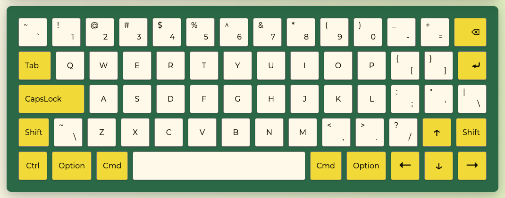

# RS School 2021 - Virtual keyboard

<p align="center"><a href="https://lazy-ocean.github.io/virtual-keyboard/" rel="noopener noreferrer" target='_blank'></a></p>

Vanilla JS + DOM API virtual keyboard made for **[RS School JavaScript/Front-end Mentoring Program](https://rs.school/poland/)** in Poland.

## Deployment

**[Virtual keyboard](https://lazy-ocean.github.io/virtual-keyboard/)** on GitHub Pages

## Local setup

1. Clone this repository
2. Switch to `development` branch:

```
$ git checkout development
```

3. Install dependencies:

```
$ npm i
```

4. Start a local server:

```
$ npm run start
```

Your app is served at [http://localhost:3000](http://localhost:3000).

## Task Requirements

1. `index.html` file should be empty (all the necessary elements are generated with the usage of JS)
2. Pressing a key on a physical keyboard highlights the key on virtual keyboard
3. Switching between 2 languages with chosen language saved after reloading
4. Keystrokes are animated
5. Functional keys works as they should:
   - pressing the `Up`, `Down`, `Left` or `Right` arrow key inputs an arrow symbol in the input field, or implements navigation on the text area.
   - pressing the `Enter` should move a text cursor to the next line - the `Tab` key creates a horizontal indent
   - pressing the rest of the function keys on a keyboard does not result in inputting symbols
   - the `Backspace` key removes character before the text cursor
   - the `Shift`, `Alt`, `Ctrl`, `Caps lock` and `Space` keys should work as on a real keyboard.

## Technical Requirements

- should work on the latest Chrome version
- usage of JQuery and other JS libraries is not allowed
- usage of Bootstrap and other UI libraries is not allowed
- usage of Angular/React/Vue and other frameworks is not allowed
- you can use CSS preprocessors
- ESLint (eslint-config-airbnb-base) should be used.
